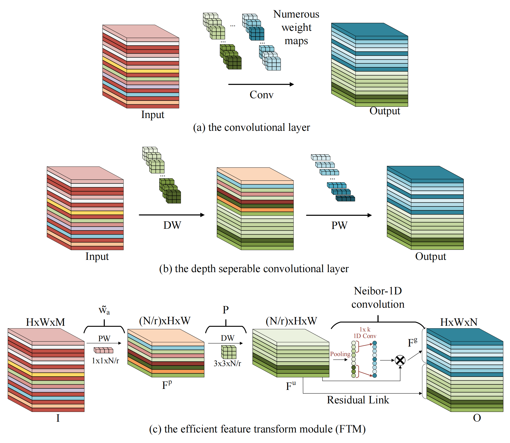

# EFTM

#### Introduction

This repo. is  a pytorch(1.10.1) implementation of Efficient Feature Transfer Module. The FTM module can be used as a plug-and-play feature extraction layer, allowing it to be easily integrated into existing CNN architectures with a significant reduction in model size and computation.



#### Training

1. config your training settings in `run.sh`.
2. configurable arguments:

   ```
     usage: trainer.py [-h] [--arch ARCH] [--dataset {cifar10,cifar100}] [-j N] [--epochs N] 
      	[--start-epoch N] [-b N] [--lr LR] [--momentum M] [--weight-decay W] [--print-freq N] 
      	[--resume PATH] [-e] [--pretrained] [--half] [--save-dir SAVE_DIR] [--save-every SAVE_EVERY]
   ```
3. train your backbone

   ```
   bash run.sh
   ```

#### Evaluate

1. config your evaluate settings in `eval.sh`.
2. evaluate your backbone

   ```
   bash eval.sh
   ```
